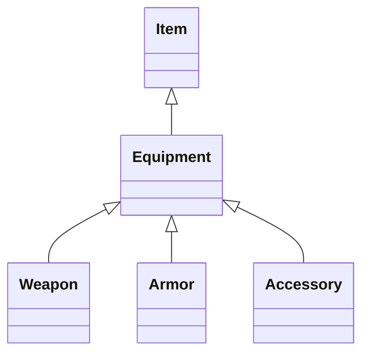
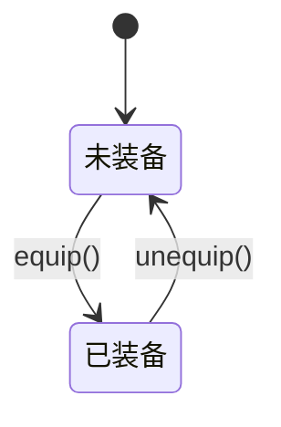
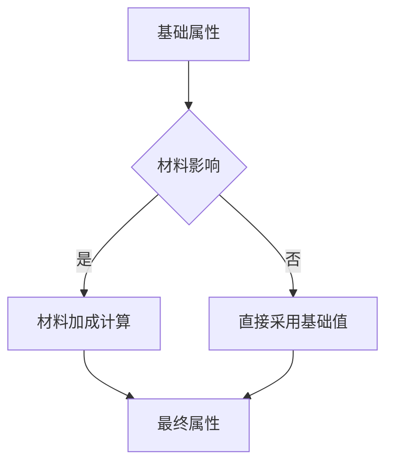

# Equipment类用户手册

## 目录
1. [类体系概述](#类体系概述)
2. [核心功能机制](#核心功能机制)
3. [装备创建规范](#装备创建规范)
4. [属性系统详解](#属性系统详解)
5. [方法使用指南](#方法使用指南)
6. [开发示例](#开发示例)
7. [注意事项](#注意事项)
8. [Q&A](#qa)

---

## 类体系概述

### 类继承树


### 类职责
| 类名      | 类型标记                   | 职责范围              |
| --------- | -------------------------- | --------------------- |
| Equipment | 抽象基类                   | 装备通用逻辑/属性管理 |
| Weapon    | equipment_type='weapon'    | 近战/远程武器实现     |
| Armor     | equipment_type='armor'     | 护甲/防具实现         |
| Accessory | equipment_type='accessory' | 饰品/特殊装备实现     |

---

## 核心功能机制

### 1. 装备穿戴系统
```python
# 装备状态切换示例
sword = Weapon()
player.equip_item(sword)  # 装备
player.unequip_item(sword)  # 卸下
```
状态转换图：


### 2. 属性加成系统
```python
# 加成效果示例
self.bonuses = {
    'atk': 15,          # 物理攻击+15
    'crit': 0.05   # 暴击率+5%
}
```

### 3. 复合抗性系统
```python
self.resistances = {
    'fire': 0.2,    # 火焰抗性20%
    'ice': -0.1     # 冰霜易伤10%
}
```

### 4. 特殊效果触发
```python
if self.spe_effect_id == EFFECT_LEECH:
    # 吸血效果实现
```

---

## 装备创建规范

### 1. 继承要求
```python
class LegendarySword(Weapon):
    def __init__(self, **kwargs):
        kwargs.setdefault('name', '圣剑艾克斯卡利伯')
        super().__init__(**kwargs)
        # 自定义属性初始化
```

### 2. 必选参数
| 参数           | 类型 | 说明                |
| -------------- | ---- | ------------------- |
| equipment_type | str  | 必须与子类类型匹配  |
| item_id        | int  | 必须存在于ITEM_ID表 |

### 3. 推荐参数配置
```python
class DragonArmor(Armor):
    def __init__(self, **kwargs):
        kwargs.update({
            'materials': {m_DragonScale: 0.8, m_Mithril: 0.2},
            'bonuses': {'def': 40, 'hp_max': 200},
            'resistances': {'fire': 0.5},
            'spe_effect_id': EFFECT_DRAGON_SKIN
        })
        super().__init__(**kwargs)
```

---

## 属性系统详解

### 属性计算流程


### 材料影响规则
| 装备类型  | 计算规则                     |
| --------- | ---------------------------- |
| weapon    | 侧重攻击属性（ATK/CRIT等）   |
| armor     | 侧重防御属性（DEF/HP_MAX等） |
| accessory | 侧重特殊属性（MP_MAX/EVA等） |

---

## 方法使用指南

### 核心方法
#### 1. `use()`
```python
def use(self, target):
    """装备状态切换入口
    返回值：
    1 - 操作成功
    -20 - 未指定目标且未装备
    -21 - 无有效持有者
    """
```

#### 2. `get_basic_status()`
显示模式示例：
```
[圣剑] 攻击力+15 暴击率5% 
耐久 87/100 
材料：龙鳞(80%) 秘银(20%)
```

### 生命周期方法
```python
def durability_down(self, value):
    # 重写父类方法，添加装备检查
    if self.is_equipped:
        super().durability_down(value * 0.8)  # 装备时损耗减少
```

---

## 开发示例

### 1. 基础武器实现
```python
class IronSword(Weapon):
    def __init__(self, **kwargs):
        kwargs.update({
            'item_id': 101,
            'bonuses': {'atk': 20},
            'resistances': {'normal': 0.1},
            'materials': {m_Iron: 1}
        })
        super().__init__(**kwargs)
```

### 2. 特效护甲实现
```python
class FlameArmor(Armor):
    def __init__(self, **kwargs):
        super().__init__(**kwargs)
        self.spe_effect_id = EFFECT_FIRE_AURA
        self.add_effect(ContinuousDamageEffect(
            damage_type='fire',
            value=15,
            interval=3
        ))
```

---

## 注意事项

### 1. 关键限制
- 同一类型装备同时只能装备一件
- 饰品类默认可装备多个（需在Character类实现限制）
- 装备损坏时自动解除装备

### 2. 调试建议
```python
# 查看完整属性信息
print(equipment.get_basic_status(mode='data')) 

# 验证材料影响
equipment.re_cal_material_bonus()
```

---

## Q&A

### Q1 如何实现装备套装效果？
```python
# 在Character类中添加检查
if set(['helm', 'armor', 'boots']).issubset(equipped_items):
    activate_set_bonus()
```

### Q2 如何处理装备强化系统？
```python
class EnhancedWeapon(Weapon):
    def enhance(self, level):
        self.upgrade_level = level
        self.bonuses['atk'] += level * 5
        self.re_cal_material_bonus()
```

### Q3 为什么材料加成不生效？
检查点：
1. `attributes_affected_by_material=True` 是否设置
2. 材料字典占比总和是否为1
3. convert_type是否匹配装备类型