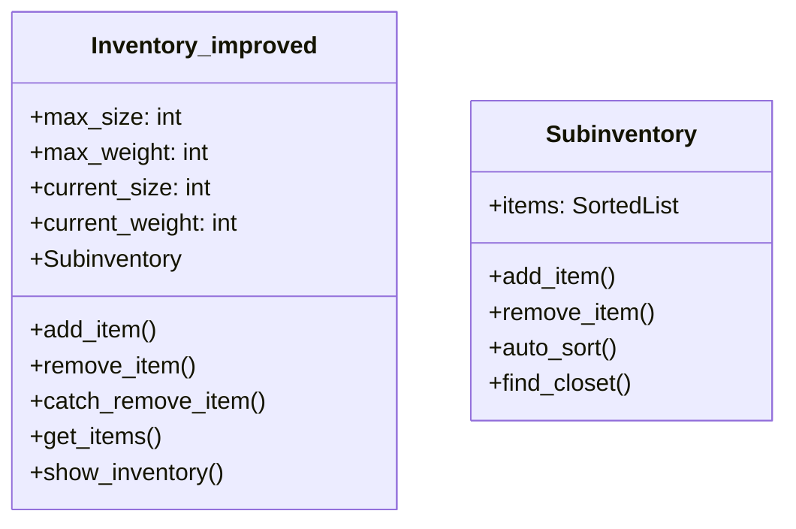

# 仓库系统用户手册

## 目录
1. [类体系概述](#类体系概述)
2. [核心功能机制](#核心功能机制)
3. [存储结构详解](#存储结构详解)
4. [方法使用指南](#方法使用指南)
5. [使用示例](#使用示例)
6. [注意事项](#注意事项)
7. [Q&A](#qa)

---

## 类体系概述

`Inventory_improved` 类实现了一个多层级的智能库存管理系统，主要特性包括：
- **智能分类存储**：自动按物品类型分类存储
- **容量双限制**：同时管理空间和重量限制
- **自动优化**：内置自动整理和排序机制
- **高效检索**：支持多种查询方式和快速定位



---

## 核心功能机制

### 1. 多层级存储结构
```python
# 存储结构示意图
Inventory_improved
├── Weapon_Subinventory (Subinventory)
│   ├── (排序值1, 长剑, 3)
│   └── (排序值2, 法杖, 1)
├── Armor_Subinventory (Subinventory)
│   └── (排序值3, 锁甲, 2)
└── Potion_Subinventory (Subinventory)
    └── (排序值4, 治疗药水, 12)
```

### 2. 容量双限制系统
```python
# 容量计算规则
总占用空间 = Σ(物品大小 × 数量)
总重量 = Σ(物品重量 × 数量)
添加物品时实时校验：
if (当前空间 + 新增空间) > max_size → 添加失败
if (当前重量 + 新增重量) > max_weight → 添加失败
```

### 3. 自动优化机制
| 触发条件               | 执行操作       | 性能影响 |
| ---------------------- | -------------- | -------- |
| 添加物品计数达100次    | 全仓库自动整理 | 中       |
| 单个子仓库物品超300    | 显示整理提示   | 低       |
| 子仓库物品超10个堆叠项 | 执行堆叠合并   | 高       |

---

## 存储结构详解

### 1. Subinventory 子仓库类
```python
class Subinventory:
    def __init__(self):
        self.items = SortedList()  # 三元组结构 (排序值, 物品实例, 数量)
```

#### 排序规则实现
```python
# 排序键配置示例（INV_SORT_METHODS）
INV_SORT_METHODS = {
    'Weapon': 'damage',        # 武器按伤害排序
    'Potion': 'quality',       # 药水按品质排序
    'Material': 'rarity'       # 材料按稀有度排序
}

# 自定义排序键设置
class CustomItem(Item):
    def __init__(self):
        self.sort_key = 'custom_value'  # 需在子类中定义
```

### 2. 物品存储格式
| 字段     | 类型 | 说明                 |
| -------- | ---- | -------------------- |
| 排序值   | int  | 根据物品类型自动计算 |
| 物品实例 | Item | 深拷贝后的实例       |
| 数量     | int  | 可堆叠物品的累计数量 |

---

## 方法使用指南

### 1. 核心操作方法
#### add_item()
```python
def add_item(item: Item, quantity: int = 1) -> list[Item]
```
**功能**：添加物品到仓库  
**参数**：
- `item`: 要添加的物品实例（自动深拷贝）
- `quantity`: 添加数量

**执行流程**：
1. 容量校验 → 失败返回空列表
2. 创建独立副本（非堆叠物品）
3. 更新空间/重量计数
4. 触发自动整理检查

**返回**：成功添加的物品实例列表

---

#### remove_item()
```python
def remove_item(item: Item, quantity: int = 1) -> None
```
**注意点**：
- 直接修改仓库数据
- 不返回被移除的物品
- 主要用于销毁物品

---

#### catch_remove_item()
```python
def catch_remove_item(item: Item, quantity: int = 1) -> list[Item]
```
**与remove区别**：
- 返回被移除的物品实例列表
- 自动解除物品所有权（owner=None）
- 用于物品转移场景

---

### 2. 查询方法族
#### get_items()
```python
def get_items(item_type: type, spe_val: int = None, mode='all') -> list
```
**模式说明**：
- `all`：返回原始存储三元组
- `display`：返回可视化字典
- `all_items`：展开为物品实例列表

**特殊值查询**：
```python
# 查找最接近spe_val的物品
spe_val=75 → 返回排序值最接近75的物品
```

---

#### get_exact_item()
```python
def get_exact_item(spe_val: int = None, uuid: str = None) -> Item
```
**精准定位方式**：
- UUID精确匹配（优先）
- 排序值精确匹配
- 物品实例匹配

---

### 3. 显示方法
#### show_inventory()
```python
def show_inventory(item_type=None, display_mode='undetailed')
```
**显示规则**：
- 默认显示所有类别概要
- 详细模式显示物品完整属性
- 不同所有权物品用颜色区分：
  - 红色：非当前角色所有
  - 默认色：当前角色所有

---

## 使用示例

### 1. 基础操作流程
```python
# 初始化角色仓库
warrior = Character(name="亚瑟")
inventory = Inventory_improved(owner=warrior)

# 添加武器
sword = Weapon(name="精钢长剑", size=2, weight=5)
added = inventory.add_item(sword, 3)  # 添加3把长剑

# 转移物品到其他仓库
other_inv = Inventory_improved()
removed = inventory.catch_remove_item(sword, 2)
other_inv.add_item(removed)

# 查询武器类物品
weapons = inventory.get_items(Weapon, mode='display')
```

### 2. 高级查询示例
```python
# 查找特定UUID的装备
target_uuid = "550e8400-e29b-41d4-a716-446655440000"
equipment = inventory.get_exact_item(uuid=target_uuid)

# 按品质搜索药水
potions = inventory.get_items(Potion, spe_val=4)  # 查找品质4左右的药水
```

---

## 注意事项

### 1. 关键约束
| 约束项             | 处理方式                   |
| ------------------ | -------------------------- |
| 非堆叠物品数量超限 | 拒绝添加并返回错误代码 -26 |
| 移除未持有物品     | 静默失败，记录调试日志     |
| 跨所有权操作       | 显示红色警告标识           |

### 2. 性能建议
- 批量操作优先使用`catch_remove_item`
- 频繁添加时适当提高`auto_sort_count`阈值
- 大量同类型物品使用专用子仓库查询

### 3. 调试技巧
```python
# 查看仓库状态
inventory.show_inventory(display_mode='detailed')

# 监控自动整理
debug_log.set_level(LOG_LEVEL.DEBUG)
```

---

## Q&A

### Q1 如何实现跨仓库转移？
```python
# 从A仓库抓取
items = inv_a.catch_remove_item(item, qty)

# 添加到B仓库
success = inv_b.add_item(items)
if not success:
    inv_a.add_item(items)  # 回滚操作
```

### Q2 如何处理特殊排序需求？
```python
class LegendaryItem(Item):
    @property
    def sort_key(self):
        return self.power * 100 + self.quality

INV_SORT_METHODS['LegendaryItem'] = 'sort_key'
```

### Q3 如何扩展仓库容量？
```python
# 动态调整容量限制
character.inventory.max_size = 200
character.inventory.max_weight = 1000

# 通过装备效果加成
class Backpack(Equipment):
    def on_equip(self):
        self.owner.inventory.max_size += 50
```