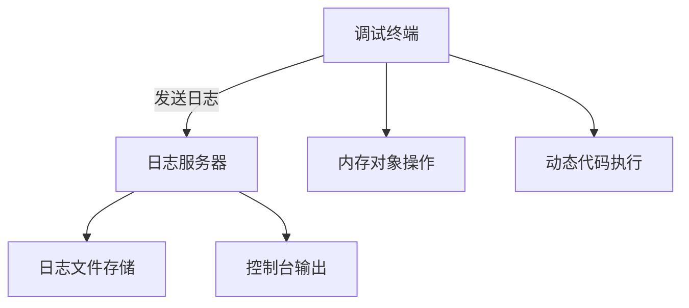

# 动态调试器系统用户手册

## 目录
1. [系统概述](#系统概述)
2. [主要功能](#主要功能)
3. [安装与配置](#安装与配置)
4. [使用指南](#使用指南)
5. [命令参考手册](#命令参考手册)
6. [典型应用场景](#典型应用场景)
7. [注意事项](#注意事项)
8. [常见问题解答](#常见问题解答)

---

## 系统概述
本动态调试器系统由两大核心模块组成：
1. **日志服务器(debugger.py)**：提供分布式日志收集功能，支持多客户端实时日志监控
2. **交互式调试终端(test_all.py)**：实现动态对象管理、实时代码执行和内存分析功能



---

## 主要功能
1. **实时日志监控**
   - 多进程/多线程日志聚合
   - 日志分级存储（DEBUG/INFO/WARNING/ERROR）
2. **动态对象管理**
   - 实例检索与属性分析
   - 对象引用追踪与内存回收
3. **交互式调试**
   - 实时Python代码执行
   - 类/方法反射机制
4. **内存分析**
   - 对象实例统计
   - 内存泄漏检测

---

## 安装与配置
### 环境要求
- Python 3.7+
- Windows/Linux/macOS
- 网络端口9020开放

### 部署步骤
1. **文件部署**
```bash
项目根目录/
├── syst/
│   ├── debugger.py    # 日志服务器
│   └── test_all.py    # 调试终端
```

2. **依赖安装**
```bash
pip install psutil memory_profiler
```

3. **启动服务**
```bash
# 启动日志服务器（独立窗口）
python syst/debugger.py

# 启动调试终端
python syst/test_all.py
```

---

## 使用指南
### 启动流程
1. 首先启动日志服务器
2. 在调试终端初始化日志连接
3. 使用交互式命令进行调试

### 初始化配置
```python
set_debug_mode(True)   # 启用调试模式
start_console_logger()  # 连接日志服务器
```

---

## 命令参考手册

### 基础命令
| 命令    | 功能           | 示例    |
| ------- | -------------- | ------- |
| exit    | 退出调试终端   | exit    |
| vars    | 显示全局变量表 | vars    |
| classes | 列出所有类定义 | classes |

### 对象管理命令
| 命令格式                  | 功能描述         | 参数说明                |
| ------------------------- | ---------------- | ----------------------- |
| objects <类名>            | 显示类实例列表   | 类名：目标类名称        |
| get_objects <类名> <索引> | 获取实例引用信息 | 索引：实例位置(1-based) |
| del_objects <类名> <索引> | 清除实例内存引用 | 索引：实例位置(1-based) |

### 反射命令
| 命令格式       | 功能描述       | 示例              |
| -------------- | -------------- | ----------------- |
| methods <类名> | 显示类方法列表 | methods Character |

---

## 典型应用场景

### 场景1：查看角色实例
```bash
# 输入命令
objects Character

# 输出示例
类 [Character] 的实例列表:
1. <Character object at 0x000001> || Hero,UUID:1234-5678 
2. <Character object at 0x000002> || Enemy,UUID:5678-1234
```

### 场景2：动态修改属性
```bash
# 执行Python代码
hero.hp = 1000
hero.equip_item(Weapon("圣剑"))
```

### 场景3：内存泄漏处理
```bash
# 查找多余实例
objects Item
>> 3. <Item object at 0x000003> || 损坏的护甲

# 清除实例
del_objects Item 3
>> 已清除全局变量: broken_armor
```

---

## 注意事项
1. **内存管理**
   - 使用`del_objects`后需手动调用`gc.collect()`
   - 批量操作对象时注意索引变化

2. **类名规范**
   - 需使用完全限定类名（区分大小写）
   - 动态创建的类需提前导入

3. **网络配置**
   - 确保9020端口未被防火墙拦截
   - 分布式部署需修改`localhost`为实际IP

---

## 常见问题解答

### Q1：日志服务器无法启动
**现象**：端口占用错误  
**解决方案**：
```bash
# 查找占用进程
netstat -ano | findstr 9020
# 结束冲突进程
taskkill /PID <进程ID> /F
```

### Q2：对象引用未清除
**现象**：`del_objects`后实例仍存在  
**验证步骤**：
```bash
# 查看GC引用
gc.get_referrers(target_instance)
# 强制垃圾回收
gc.collect()
```

### Q3：动态代码执行失效
**排查步骤**：
1. 检查变量作用域（使用`global_vars`字典）
2. 验证语句在独立环境中的执行结果
3. 查看日志服务器错误输出

---

## 高级调试技巧

### 实时监控内存
```python
# 启用内存跟踪
tracemalloc.start()

# 获取内存快照
snapshot = tracemalloc.take_snapshot()
top_stats = snapshot.statistics('lineno')
```

### 性能分析模式
```bash
# 使用cProfile进行分析
python -m cProfile -o profile.data test_all.py

# 查看分析结果
import pstats
p = pstats.Stats('profile.data')
p.sort_stats('cumtime').print_stats(10)
```

---

