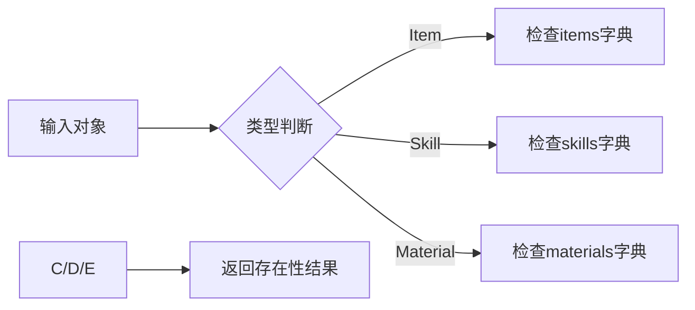

# 图鉴系统用户手册

## 目录
1. [类概述](#类概述)
2. [核心功能](#核心功能)
3. [方法详解](#方法详解)
4. [使用示例](#使用示例)
5. [注意事项](#注意事项)
6. [Q&A](#qa)

---

## 类概述

`illustrated_handbook` 类用于管理角色对游戏内元素的认知体系，实现以下核心功能：
- **知识管理**：记录角色已识别的物品/技能/材料信息
- **鉴定系统**：支持对未知物品的鉴定状态管理
- **信息查询**：提供已掌握知识的可视化展示


---

## 核心功能

### 1. 知识存储结构
| 存储类型 | 数据结构        | 键名规则 | 容量限制 |
| -------- | --------------- | -------- | -------- |
| 物品知识 | `items`字典     | 物品ID   | 无       |
| 技能知识 | `skills`字典    | 技能ID   | 无       |
| 材料知识 | `materials`字典 | 材料ID   | 无       |

### 2. 状态管理机制
```python
# 状态转换示意图
未识别 --> 已识别 : learn()
已识别 --> 未识别 : forget()
```

### 3. 调试支持
```python
debug_log.log_debug("<Iv:learn>...")  # 记录学习过程
debug_log.log_debug("<Iv:forget>...") # 记录遗忘事件
```

---

## 方法详解

### 1. learn()
```python
def learn(self, object) -> None
```
**功能**：学习新的游戏元素  
**参数**：
- `object`: 需学习的对象（Item/Skill/Material类型）

**行为逻辑**：
1. 空值检查：若object为None立即返回
2. 类型判定：
   - Item对象存入`items`字典
   - Skill对象存入`skills`字典 
   - Material对象存入`materials`字典
3. 日志记录：输出学习提示和调试信息

**异常处理**：
- 重复学习：直接覆盖原有条目
- 错误类型：非指定类型对象会被忽略

---

### 2. forget()
```python
def forget(self, object) -> None
```
**功能**：遗忘已掌握的知识  
**参数**：
- `object`: 需遗忘的对象（Item/Skill/Material类型）

**注意事项**：
- 尝试遗忘未学习的对象会引发KeyError
- 建议先使用check()进行存在性验证

---

### 3. check()
```python
def check(self, object) -> bool
```
**功能**：验证对象是否已被识别  
**返回**：
- `True`: 已掌握该对象知识
- `False`: 未识别或类型错误

**类型支持**：


---

### 4. show()
```python
def show(self, type: str = 'item') -> None
```
**功能**：可视化展示已掌握知识  
**参数**：
- `type`: 展示类型，可选值：
  - `'item'`: 物品图鉴（默认）
  - `'skill'`: 技能图鉴
  - `'material'`: 材料图鉴

**输出格式**：
```bash
[物品图鉴示例]
治疗药水: 回复50点生命值 | 价格: 30金币
魔法卷轴: 造成火焰伤害 | 使用次数: 3/5
```

---

## 使用示例

### 1. 基础使用流程
```python
# 初始化角色和图鉴
warrior = Character(name="亚瑟")
handbook = illustrated_handbook(warrior)

# 学习新物品
health_potion = Item(item_id=101, name="超级治疗药剂")
handbook.learn(health_potion)

# 检查知识掌握
print(handbook.check(health_potion))  # 输出: True

# 展示物品图鉴
handbook.show('item')

# 遗忘知识
handbook.forget(health_potion)
print(handbook.check(health_potion))  # 输出: False
```

### 2. 批量学习实现
```python
# 材料批量学习
materials = [
    Material(material_id=1, name="铁矿石"),
    Material(material_id=2, name="魔法粉尘")
]

for mat in materials:
    handbook.learn(mat)

handbook.show('material')
```

---

## 注意事项

### 1. 关键约束
- **ID唯一性**：同类型对象的ID必须唯一
- **类型纯净**：对象必须明确属于Item/Skill/Material类型
- **生命周期**：图鉴实例应与角色实例绑定

### 2. 异常场景处理
| 场景             | 建议处理方式            |
| ---------------- | ----------------------- |
| 遗忘未学习的对象 | 先调用check()验证存在性 |
| 传入非法类型对象 | 添加类型检查断言        |
| 显示未学习的类型 | 返回空列表或提示信息    |

### 3. 性能建议
- 频繁调用show()时建议实现缓存机制
- 大规模数据存储时考虑字典性能优化

---

## Q&A

### Q1 如何实现跨角色知识共享？
```python
# 创建共享图鉴实例
shared_handbook = illustrated_handbook(None)

# 角色类添加访问方法
class Character:
    def access_shared_handbook(self):
        return shared_handbook
```

### Q2 学习时如何防止重复条目？
```python
# 在learn方法中添加存在性检查
if not self.check(object):
    # 执行存储操作
else:
    print("已掌握该知识")
```

### Q3 如何扩展新的知识类型？
1. 继承基类添加新类型字典
2. 修改check/learn/forget的类型判断逻辑
3. 扩展show()方法支持新类型展示

```python
class ExtendedHandbook(illustrated_handbook):
    def __init__(self, owner):
        super().__init__(owner)
        self.monsters = {}  # 新增怪物图鉴

    def learn(self, object):
        if isinstance(object, Monster):
            self.monsters[object.mid] = object
        else:
            super().learn(object)
```