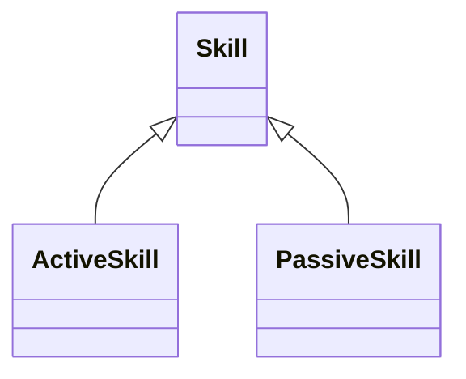

# 技能系统用户手册

## 目录
1. [体系概述](#体系概述)
2. [核心类说明](#核心类说明)
3. [技能创建规范](#技能创建规范)
4. [属性详解](#属性详解)
5. [方法实现指南](#方法实现指南)
6. [示例应用](#示例应用)
7. [调试与优化](#调试与优化)
8. [Q&A](#qa)

---

## 体系概述

### 类继承结构


### 技能类型对比
| 特性     | ActiveSkill       | PassiveSkill         |
| -------- | ----------------- | -------------------- |
| 触发方式 | 主动释放          | 自动生效             |
| 实现要求 | 必须实现use()方法 | 必须实现阶段触发逻辑 |
| 典型应用 | 火球术、治疗术    | 攻击强化、属性抗性   |
| 冷却系统 | 支持              | 无                   |

---

## 核心类说明

### 1. Skill 基类
#### 关键属性
```python
class Skill:
    def __init__(self,
                effect,          # 技能效果函数
                quality=0,       # 品质等级（影响颜色显示）
                skill_id=0,      # 必须注册的ID
                name='未命名',    # 显示名称
                description='',  # 技能描述
                cost={},         # 消耗资源字典 
                skill_type='active'):
```

### 2. ActiveSkill 主动技能
```python
class ActiveSkill(Skill):
    def __init__(self, 
                cooldown=0,      # 冷却回合数
                scope=SkillScope.NONE,  # 作用范围枚举
                **kwargs):
```

### 3. PassiveSkill 被动技能
```python
class PassiveSkill(Skill):
    def __init__(self,
                bonuses={},      # 属性加成字典
                resistances={},  # 抗性加成字典
                phase=Phase.NONE,# 触发阶段枚举
                **kwargs):
```

---

## 技能创建规范

### 1. ID注册要求
```python
# 必须确保技能ID全局唯一
SKILL_ID = {
    1001: "火球术",
    1002: "治疗之光",
    2001: "钢铁之躯"
}

class FireballSkill(ActiveSkill):
    def __init__(self):
        super().__init__(skill_id=1001)  # 必须匹配ID表
```

### 2. 效果函数规范
```python
# 主动技能效果函数模板
def fire_effect(caster, targets, battle):
    for target in targets:
        dmg = caster.atk * 1.5 - target.defense
        target.take_damage(dmg)

fireball = ActiveSkill(effect=fire_effect)
```

### 3. 消耗系统格式
```python
cost = {
    'mp': 15,       # 消耗15法力
    'hp': 5,        # 消耗5生命
    'item': (potion, 1)  # 消耗1个药水
}
```

---

## 属性详解

### 关键属性表
| 属性        | 类型            | 说明                            |
| ----------- | --------------- | ------------------------------- |
| scope       | SkillScope 枚举 | 技能作用范围（单体/群体/全体）  |
| phase       | Phase 枚举      | 被动触发阶段（攻击时/受击时等） |
| bonuses     | dict            | 被动加成（{'atk':0.15}）        |
| resistances | dict            | 被动抗性（{'fire':0.3}）        |

### SkillScope 作用域枚举
```python
class SkillScope(Enum):
    SINGLE = 1     # 单体目标
    MULTI = 3      # 群体目标（3人）
    ALLY_ALL = 4   # 全体友方
    ENEMY_ALL = 5  # 全体敌方
```

---

## 方法实现指南

### 1. 主动技能实现
```python
class HealSkill(ActiveSkill):
    def use(self, caster, targets, battle):
        if caster.mp < self.cost.get('mp', 0):
            return -1  # 法力不足
        
        for target in targets:
            heal_amount = caster.magic * 2
            target.heal(heal_amount)
        
        caster.mp -= self.cost['mp']
        self.cur_cooldown = self.cooldown
        return 1
```

### 2. 被动技能实现
```python
class SteelBody(PassiveSkill):
    def on_phase(self, phase, character, battle):
        if phase == Phase.BEFORE_ATTACK:
            character.defense += 20  # 攻击前临时增加防御
```

---

## 示例应用

### 1. 火焰冲击技能
```python
fire_blast = ActiveSkill(
    skill_id=1003,
    name="烈焰冲击",
    description="对单体目标造成150%攻击力的火焰伤害",
    cost={'mp': 20},
    cooldown=2,
    scope=SkillScope.SINGLE,
    effect=lambda caster, targets, battle: [
        t.take_damage(caster.atk * 1.5, 'fire') for t in targets
    ]
)
```

### 2. 战斗狂热被动
```python
berserk_passive = PassiveSkill(
    skill_id=2002,
    name="战斗狂热",
    description="HP低于30%时攻击力提升50%",
    bonuses={'atk': 0.5},
    phase=Phase.HP_LOW,
    trigger_condition=lambda char: char.hp_percent < 0.3
)
```

---

## 调试与优化

### 调试检查表
1. 技能ID是否已注册
2. 消耗资源类型是否匹配角色属性
3. 冷却计时器是否正确更新
4. 被动阶段枚举是否匹配触发点

### 性能优化建议
```python
# 使用缓存减少重复计算
class CachedSkill(Skill):
    def __init__(self):
        self._effect_cache = {}
    
    def get_effect_value(self, caster):
        if caster not in self._effect_cache:
            self._effect_cache[caster] = caster.int * 1.2
        return self._effect_cache[caster]
```

---

## Q&A

### Q1 如何实现群体治疗技能？
```python
class MassHeal(ActiveSkill):
    def __init__(self):
        super().__init__(scope=SkillScope.ALLY_ALL)
    
    def use(self, caster, targets, battle):
        for ally in targets:
            ally.heal(caster.magic * 1.8)
```

### Q2 如何制作条件触发的被动？
```python
class CounterAttack(PassiveSkill):
    def __init__(self):
        super().__init__(phase=Phase.AFTER_DAMAGED)
    
    def on_trigger(self, character, damage):
        if damage.source:
            damage.source.take_damage(character.atk * 0.8)
```

### Q3 如何管理技能冷却？
```python
# 在战斗系统中更新
def update_cooldowns():
    for skill in active_skills:
        if skill.cur_cooldown > 0:
            skill.cur_cooldown -= 1
```