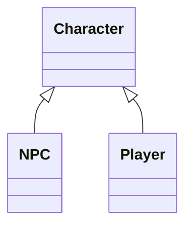
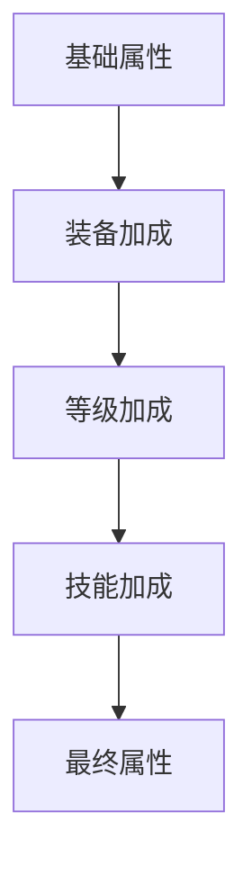

# 角色系统用户手册 

## 目录
1. [类体系概述](#类体系概述)
2. [核心机制详解](#核心机制详解)
3. [属性系统](#属性系统)
4. [装备与技能管理](#装备与技能管理)
5. [战斗与状态管理](#战斗与状态管理)
6. [物品与升级系统](#物品与升级系统)
7. [开发示例](#开发示例)
8. [注意事项](#注意事项)
9. [Q&A](#qa)

---

## 类体系概述

### 类继承结构


### 核心模块
| 模块         | 功能描述                     |
| ------------ | ---------------------------- |
| 动态属性系统 | 基于元类的属性自动生成机制   |
| 装备管理模块 | 装备穿戴/卸下与属性加成系统  |
| 经验升级系统 | 非线性经验曲线与等级成长机制 |
| 战斗状态机   | 战斗行为与状态效果管理系统   |
| 物品交互系统 | 复杂物品使用与装备修理机制   |

---

## 核心机制详解

### 1. 动态属性系统
```python
# 属性生成规则示例
@classmethod
def _create_property(cls, prop_name):
    """工厂方法创建动态属性"""
    def getter(self):
        return (
            self._base_data.get(prop_name, 0) +  # 基础值
            self._equipment_bonus.get(prop_name, 0) +  # 装备加成
            self._lv_bonus.get(prop_name, 0) +  # 等级加成
            self._skill_bonus.get(prop_name, 0)  # 技能加成
        )
    return property(getter)
```

### 2. 属性计算流程


---

## 属性系统

### 基础属性表
| 属性名   | 类型  | 描述            |
| -------- | ----- | --------------- |
| max_hp   | int   | 最大生命值      |
| atk      | int   | 基础攻击力      |
| defe     | int   | 基础防御力      |
| spd      | int   | 行动速度        |
| crit     | float | 暴击率（0-1）   |
| crit_dmg | float | 暴击伤害倍数    |
| eva      | float | 闪避率（0-0.9） |

### 复合属性计算
```python
@property
def final_atk(self):
    return int(max(0, 
        self.atk * 
        getattr(self,'atk*') *  # 百分比加成
        getattr(self,'atk*L') +  # 最终百分比加成
        getattr(self,'atkL')  # 数值加成
    ))
```

---

## 装备与技能管理

### 装备操作接口
```python
# 装备武器示例
sword = Weapon(name="圣剑", atk=50)
player.equip_item(sword)  # 返回值1表示成功

# 卸下装备
player.unequip_item(sword)
```

### 技能系统
| 技能类型 | 管理方式           |
| -------- | ------------------ |
| 主动技能 | a_skills字典管理   |
| 被动技能 | p_skills字典管理   |
| 技能学习 | learn_skill()方法  |
| 技能遗忘 | forget_skill()方法 |

---

## 战斗与状态管理

### 战斗行为方法
```python
# 普通攻击示例
damage = player.attack_target(enemy, type='fire')

# 治疗行为
heal_amount = player.heal(100)

# 状态效果管理
player.status.append(BurnEffect(duration=3))
```

### 状态刷新机制
```python
def refresh_status(self):
    # 更新装备加成
    self._update_equipment_bonus()
    # 更新等级加成
    self._update_lv_bonus()
    # 强制生命值合规
    self.hp = min(self.hp, self.max_hp)
```

---

## 物品与升级系统

### 物品使用流程
```python
# 使用治疗药水示例
potion = Item(name="超级治疗药剂", heal=200)
if player.use_item(potion, target=player):
    print("治疗成功")

# 装备修理系统
player.repair_item(broken_sword, repair_kit)
```

### 经验升级曲线
```python
def exp_curve_func(lv):
    """非线性经验公式"""
    return int(lv * pow(lv, 1.6) * 1.03**lv**0.1)
```

---

## 开发示例

### 角色创建
```python
# 创建战士角色
warrior = Character(
    name="亚瑟",
    data={
        'max_hp': 1500,
        'atk': 80,
        'defe': 40,
        'crit': 0.15
    },
    equipped={
        'weapon': Weapon(name="巨人之斧"),
        'armor': Armor(name="龙鳞铠甲")
    }
)
```

### 战斗流程
```python
# 战斗循环示例
while enemy.is_alive:
    # 玩家攻击
    dmg = warrior.attack_target(enemy)
    print(f"造成 {dmg} 点伤害")
    
    # 敌人反击
    if enemy.is_alive:
        enemy_dmg = enemy.attack_target(warrior)
        print(f"受到 {enemy_dmg} 点伤害")
    
    # 状态更新
    warrior.refresh_status()
    enemy.refresh_status()
```

---

## 注意事项

### 关键约束
1. **装备唯一性**：同类型装备只能装备一件
2. **属性上限**：闪避率最高90%，抗性最高99%
3. **状态同步**：任何属性修改后必须调用refresh_status()
4. **经验锁定**：升级时自动恢复满状态

### 调试建议
```python
# 查看详细状态
player.show_status()

# 启用调试日志
debug_log.set_level(LOG_LEVEL.DEBUG)
```

---

## Q&A

### Q1 如何实现装备套装效果？
```python
class SetArmor(Armor):
    def on_equip(self):
        if self.owner.equipped['weapon'].set_id == self.set_id:
            self.owner.atk += 50

class SetWeapon(Weapon):
    set_id = 'dragon_set'
```

### Q2 如何处理复数抗性叠加？
```python
# 最终抗性计算公式
final_res = min(
    base_res + equip_res + skill_res + lv_res,
    0.99  # 抗性上限
)
```

### Q3 如何扩展新属性？
1. 在ALL_BONUS列表添加新属性名
2. 元类会自动生成相关属性
3. 实现对应的final_属性计算

```python
ALL_BONUS.append('magic_power')
@property
def final_magic_power(self):
    return self.magic_power * ...
```


# 角色类方法手册

## 目录
1. [属性管理](#属性管理)
2. [装备管理](#装备管理)
3. [战斗系统](#战斗系统)
4. [物品使用](#物品使用)
5. [经验升级](#经验升级)
6. [状态管理](#状态管理)
7. [辅助方法](#辅助方法)

---

## 属性管理

### 1. 动态属性生成
```python
@classmethod
def _create_property(cls, prop_name)
```
**功能**：工厂方法动态生成属性计算逻辑  
**参数**：
- `prop_name`：属性名称（如'atk'、'max_hp'等）

**实现逻辑**：
```python
def getter(self):
    return (基础值 + 装备加成 + 等级加成 + 技能加成)
```

### 2. 抗性属性生成
```python
@classmethod 
def _create_resistance_property(cls, res_name)
```
**功能**：动态生成抗性计算逻辑  
**参数**：
- `res_name`：抗性类型（如'fire'、'ice'等）

**计算规则**：
```python
return min(基础抗性 + 装备抗性 + 等级抗性 + 技能抗性, 0.99)
```

### 3. 最终属性计算
```python
@property
def final_atk(self)
```
| 属性       | 计算规则                           | 返回值类型 |
| ---------- | ---------------------------------- | ---------- |
| final_atk  | (基础攻击 * 百分比加成) + 数值加成 | int        |
| final_defe | (基础防御 * 百分比加成) + 数值加成 | int        |
| final_crit | 基础暴击率 * 百分比加成 + 数值加成 | float      |
| final_eva  | 基础闪避率 * 百分比加成 + 数值加成 | float      |

---

## 装备管理

### 1. equip_item()
```python
def equip_item(item: 'Equipment' = None) -> int
```
**功能**：装备指定物品  
**参数**：
- `item`：要装备的Equipment实例

**返回值**：
| 代码 | 含义                 |
| ---- | -------------------- |
| 1    | 装备成功             |
| -2   | 物品为空             |
| -12  | 装备类型不匹配       |
| -17  | 物品已被其他角色装备 |
| -18  | 重复装备同一物品     |

**示例**：
```python
sword = Weapon(name="圣剑")
result = player.equip_item(sword)
if result == 1:
    print("装备成功！")
```

### 2. unequip_item()
```python
def unequip_item(item: 'Equipment' = None) -> int
```
**功能**：卸下已装备物品  
**返回值**：
| 代码 | 含义               |
| ---- | ------------------ |
| 1    | 卸装成功           |
| -2   | 物品为空           |
| -13  | 物品未装备在该部位 |
| -19  | 物品未被装备       |

---

## 战斗系统

### 1. attack_target()
```python
def attack_target(target: 'Character', type: str = 'normal') -> int
```
**功能**：对目标发动攻击  
**参数**：
- `target`：攻击目标角色
- `type`：攻击类型（影响抗性计算）

**计算流程**：
```python
实际伤害 = max(1, (攻击方final_atk - 目标final_defe) * (1 - 目标对应抗性))
```

### 2. take_damage()
```python
def take_damage(damage: int = 0) -> None
```
**功能**：承受伤害  
**副作用**：
- 更新当前HP
- 当HP<=0时设置is_alive=False
- 自动调用refresh_status()

### 3. heal()
```python
def heal(val: int = 0) -> int
```
**功能**：治疗生命值  
**返回**：实际治疗量  
**限制**：无法治疗已死亡角色

---

## 物品使用

### 1. use_item()
```python
def use_item(item: Item = None, target: 'Character' = None) -> bool
```
**执行流程**：
1. 所有权验证
2. 是否已鉴定检查
3. 消耗品深度拷贝
4. 执行物品效果
5. 更新耐久/移除消耗品

**错误处理**：
```python
if not item.revealed:
    print("未鉴定的物品无法使用！")
    return False
```

### 2. repair_item()
```python
def repair_item(item: 'Item'=None, material_item=None) -> bool
```
**功能**：使用材料修理装备  
**计算公式**：
```
修复效果 = 材料相容性 * 材料总量 / 装备材料总量
新耐久 = 原耐久 * (1 + 修复效果)
```

---

## 经验升级

### 1. gain_exp()
```python
def gain_exp(exp: int = 0)
```
**功能**：获得经验值  
**升级机制**：
- 达到升级所需经验后自动升级
- 升级时恢复满状态
- 调用refresh_status()更新属性

### 2. exp_curve_func()
```python
@classmethod
def exp_curve_func(self, lv)
```
**经验曲线公式**：
```
基础值 = lv^2.6 * 1.03^(lv^0.1)
高级修正 = (lv/1000)^(lv^0.002) (当lv>1000时)
```

---

## 状态管理

### 1. refresh_status()
```python
def refresh_status()
```
**更新顺序**：
1. 装备加成
2. 等级加成
3. 技能加成
4. 生命/法力上限合规

### 2. show_status()
```python
def show_status()
```
**输出格式**：
```
亚瑟 LV:15 (EXP:1200/1500)
HP: 850/1000 | ATK: 150 | DEF: 80
暴击率: 25.5% | 抗火: 30.0%
装备武器：圣剑（攻击+50）
```

---

## 辅助方法

### 1. copy_with_same_uuid()
```python
def copy_with_same_uuid()
```
**用途**：创建具有相同UUID的浅拷贝  
**场景**：用于需要标识角色身份但不影响原实例时

### 2. __deepcopy__()
```python
def __deepcopy__(self, memo)
```
**深拷贝规则**：
- 生成全新UUID
- 深度复制装备、技能等引用对象
- 保留基础属性值

---

## 方法速查表

| 方法类别 | 关键方法                    | 核心功能               |
| -------- | --------------------------- | ---------------------- |
| 属性管理 | _create_property()          | 动态生成属性计算逻辑   |
| 装备管理 | equip_item()/unequip_item() | 装备穿戴与卸下         |
| 战斗系统 | attack_target()             | 执行攻击计算           |
| 物品使用 | use_item()/repair_item()    | 使用/修理物品          |
| 状态显示 | show_status()               | 显示角色完整状态       |
| 经验系统 | gain_exp()                  | 处理经验获取与升级     |
| 特殊操作 | revive()                    | 复活角色并恢复部分生命 |

---

