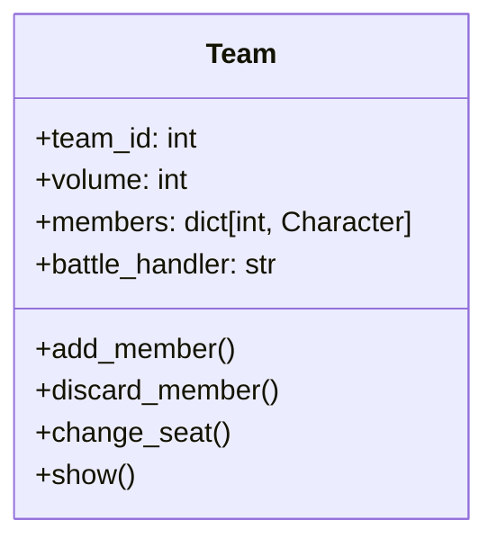

# 队伍系统用户手册

## 目录
1. [类概述](#类概述)
2. [核心属性](#核心属性)
3. [方法详解](#方法详解)
4. [使用示例](#使用示例)
5. [注意事项](#注意事项)
6. [Q&A](#qa)

---

## 类概述

`Team` 类用于管理角色队伍系统，主要功能包括：
- 成员容量管理
- 队员位置排序
- 战斗控制器设置
- 成员增删改查



---

## 核心属性

| 属性           | 类型                 | 说明                                 |
| -------------- | -------------------- | ------------------------------------ |
| team_id        | int                  | 队伍唯一标识符（关联TEAM_IDS配置表） |
| volume         | int                  | 队伍最大容量（默认1）                |
| members        | dict[int, Character] | 成员字典（key: 位置编号 1-based）    |
| battle_handler | str                  | 战斗控制模式（'cpu'/'player'）       |

---

## 方法详解

### 1. 成员排序
```python
def sort_members(self)
```
**功能**：重整成员位置编号  
**执行逻辑**：
1. 按加入顺序重新生成1-based连续位置编号
2. 自动在以下情况触发：
   - 添加新成员时
   - 移除成员后

---

### 2. 添加成员
```python
def add_member(self, ch: Character = None) -> bool
```
**参数**：
- `ch`：要添加的角色实例

**返回值**：
| 结果  | 说明                 | 错误代码                 |
| ----- | -------------------- | ------------------------ |
| True  | 添加成功             | -                        |
| False | 添加失败，原因包括： |                          |
|       | - 角色已属于其他队伍 | REMAIN_ERROR_MESSAGES[1] |
|       | - 队伍已满员         | REMAIN_ERROR_MESSAGES[2] |

---

### 3. 移除成员
```python
def discard_member(self, idx: int = 0) -> Optional[Character]
```
**参数**：
- `idx`：成员位置编号（1-based）

**返回值**：
| 结果          | 说明               |
| ------------- | ------------------ |
| Character实例 | 被移除的角色       |
| None          | 指定位置不存在成员 |

**错误处理**：
- 无效位置触发：REMAIN_ERROR_MESSAGES[3]

---

### 4. 位置交换
```python
def change_seat(self, idx1: int = 0, idx2: int = 0) -> bool
```
**参数**：
- `idx1`：第一个位置编号
- `idx2`：第二个位置编号

**返回值**：
- True：交换成功
- False：任意位置不存在成员

---

### 5. 队伍展示
```python
def show(self)
```
**输出格式示例**：
```bash
队伍 勇者小队:  |人数:3/4
1位次 亚瑟[战士]
2位次 梅林[法师]
3位次 罗宾[游侠]
```

---

## 使用示例

### 基础操作流程
```python
# 创建队伍
hero_team = Team(team_id=101, volume=4)

# 添加成员
warrior = Character(name="亚瑟")
mage = Character(name="梅林")
hero_team.add_member(warrior)
hero_team.add_member(mage)

# 交换位置
hero_team.change_seat(1, 2)

# 展示队伍
hero_team.show()

# 移除成员
removed = hero_team.discard_member(2)
```

### 错误处理示例
```python
# 尝试添加已归属角色
another_team = Team(team_id=102)
another_team.add_member(warrior)  # 触发REMAIN_ERROR_MESSAGES[1]

# 超出容量限制
for _ in range(5):
    hero_team.add_member(Character())  # 第5次触发REMAIN_ERROR_MESSAGES[2]
```

---

## 注意事项

### 关键约束
1. 成员位置编号始终从1开始连续编号
2. 角色同时只能属于一个队伍
3. 队伍容量修改需重建实例
4. 战斗模式影响AI行为决策

### 错误代码表
| 代码索引 | 错误描述               |
| -------- | ---------------------- |
| 1        | 角色已属于其他队伍     |
| 2        | 队伍人数已达上限       |
| 3        | 指定位置不存在有效成员 |

---

## Q&A

### Q1 如何实现队伍合并？
```python
def merge_teams(team1: Team, team2: Team) -> Team:
    new_team = Team(team_id=201, volume=team1.volume + team2.volume)
    for member in team1.members.values():
        new_team.add_member(member)
    for member in team2.members.values():
        new_team.add_member(member)
    return new_team
```

### Q2 如何保存队伍状态？
```python
def save_team_state(team: Team) -> dict:
    return {
        'team_id': team.team_id,
        'volume': team.volume,
        'members': {pos: char.uuid for pos, char in team.members.items()}
    }
```

### Q3 如何处理战斗中的队伍控制？
```python
# 切换控制模式
hero_team.battle_handler = 'player'  # 改为玩家手动控制

# AI自动战斗示例
if hero_team.battle_handler == 'cpu':
    for member in hero_team.members.values():
        member.auto_attack()
```